# 📊 **DIAGRAMMES D'ANALYSE UML - ECORIDE 2025**

*Document technique mis à jour le 3 octobre 2025*

---

## 📋 **TABLE DES MATIÈRES**

1. [Introduction](#introduction)
2. [Diagramme de Cas d'Utilisation](#cas-utilisation)
3. [Diagrammes de Séquence](#sequence)
4. [Modèle Conceptuel de Données (MCD)](#mcd)
5. [Diagramme de Classes](#classes)
6. [Architecture Technique](#architecture)
7. [Diagramme de Déploiement](#deploiement)

---

## 🎯 **1. INTRODUCTION** {#introduction}

Ce document présente l'analyse UML complète de l'application **EcoRide**, une plateforme de covoiturage écologique. Les diagrammes décrivent la structure, les interactions et le comportement du système.

### **Technologies Utilisées**
- **Backend** : Node.js + Express
- **Base de données** : MongoDB (NoSQL) + MySQL (Relationnel)
- **Frontend** : HTML5 + CSS3 + JavaScript
- **Authentification** : JWT
- **Sécurité** : bcrypt + helmet + CORS

---

## 👥 **2. DIAGRAMME DE CAS D'UTILISATION** {#cas-utilisation}

### **2.1 Acteurs du Système**

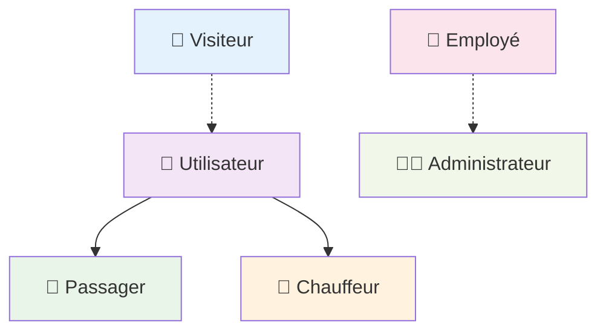

### **2.2 Cas d'Utilisation Principaux**

```mermaid
usecase
    actor Visiteur as V
    actor Utilisateur as U
    actor Passager as P
    actor Chauffeur as C
    actor Employé as E
    actor Administrateur as A
    
    package "EcoRide System" {
        usecase (Consulter accueil) as UC1
        usecase (Rechercher covoiturage) as UC2
        usecase (Voir détails trajet) as UC3
        usecase (S'inscrire) as UC4
        usecase (Se connecter) as UC5
        
        usecase (Gérer profil) as UC6
        usecase (Consulter historique) as UC7
        usecase (Laisser avis) as UC8
        
        usecase (Gérer véhicules) as UC9
        usecase (Proposer trajet) as UC10
        usecase (Gérer trajets) as UC11
        
        usecase (Réserver place) as UC12
        usecase (Annuler réservation) as UC13
        
        usecase (Modérer avis) as UC14
        usecase (Consulter litiges) as UC15
        
        usecase (Gérer employés) as UC16
        usecase (Suspendre utilisateur) as UC17
        usecase (Consulter statistiques) as UC18
    }
    
    V --> UC1
    V --> UC2
    V --> UC3
    V --> UC4
    V --> UC5
    
    U --> UC6
    U --> UC7
    U --> UC8
    
    C --> UC9
    C --> UC10
    C --> UC11
    
    P --> UC12
    P --> UC13
    
    E --> UC14
    E --> UC15
    
    A --> UC16
    A --> UC17
    A --> UC18
```

### **2.3 Description Détaillée des Cas d'Utilisation**

#### **👤 Visiteur (Non connecté)**
- **UC1** : Consulter la page d'accueil
- **UC2** : Rechercher un covoiturage (sans filtre avancé)
- **UC3** : Consulter les détails d'un covoiturage
- **UC4** : S'inscrire sur la plateforme
- **UC5** : Se connecter

#### **🚗 Utilisateur (Connecté)**
*Hérite des actions du Visiteur*
- **UC6** : Gérer son profil (modifier photo, informations)
- **UC7** : Consulter son historique de trajets
- **UC8** : Laisser un avis et une note sur un chauffeur

#### **🚙 Chauffeur (Rôle spécialisé)**
- **UC9** : Gérer ses véhicules (Ajouter, Modifier, Supprimer)
- **UC10** : Proposer un trajet
- **UC11** : Gérer ses trajets proposés (Démarrer, Terminer, Annuler)

#### **🧳 Passager (Rôle spécialisé)**
- **UC12** : Réserver une place sur un trajet
- **UC13** : Annuler sa réservation

#### **👔 Employé**
- **UC14** : Modérer les avis (Valider, Refuser)
- **UC15** : Consulter les litiges (trajets signalés)

#### **👨‍💼 Administrateur**
*Hérite des actions de l'Employé*
- **UC16** : Gérer les comptes Employés (Créer, Suspendre)
- **UC17** : Suspendre un compte Utilisateur
- **UC18** : Consulter les statistiques de la plateforme

---

## 🔄 **3. DIAGRAMMES DE SÉQUENCE** {#sequence}

### **3.1 Séquence : Inscription d'un Utilisateur**

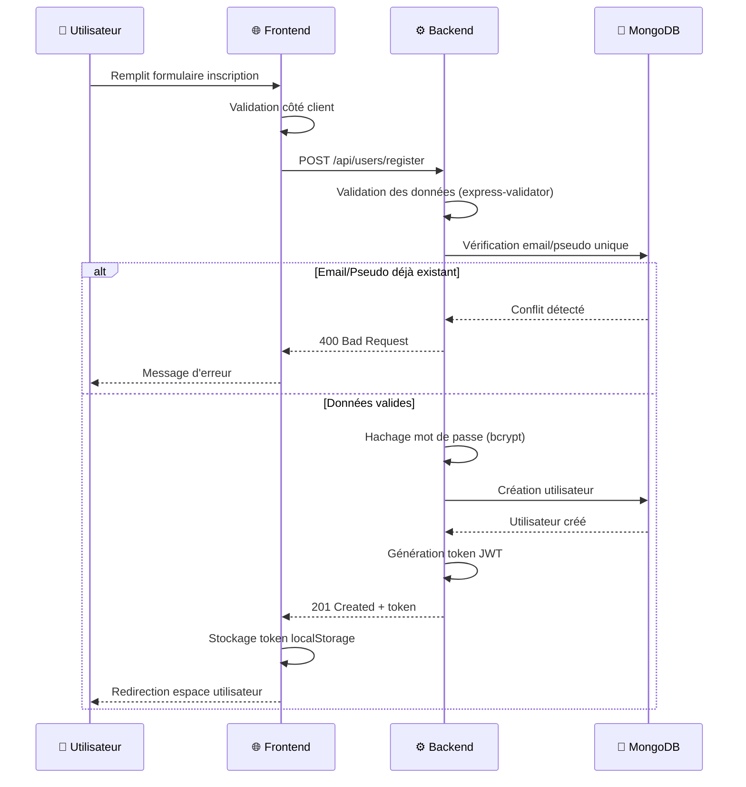

### **3.2 Séquence : Connexion Utilisateur**

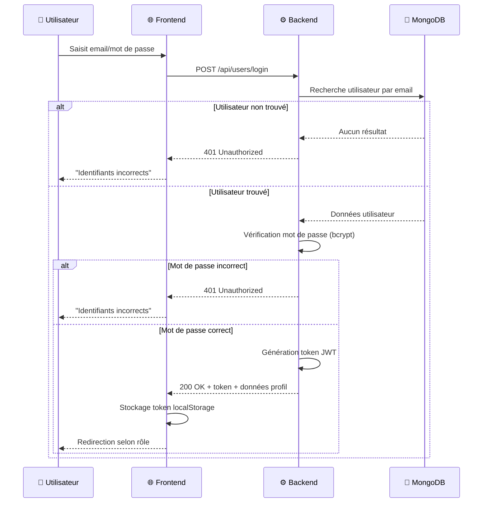

### **3.3 Séquence : Réservation d'un Trajet**

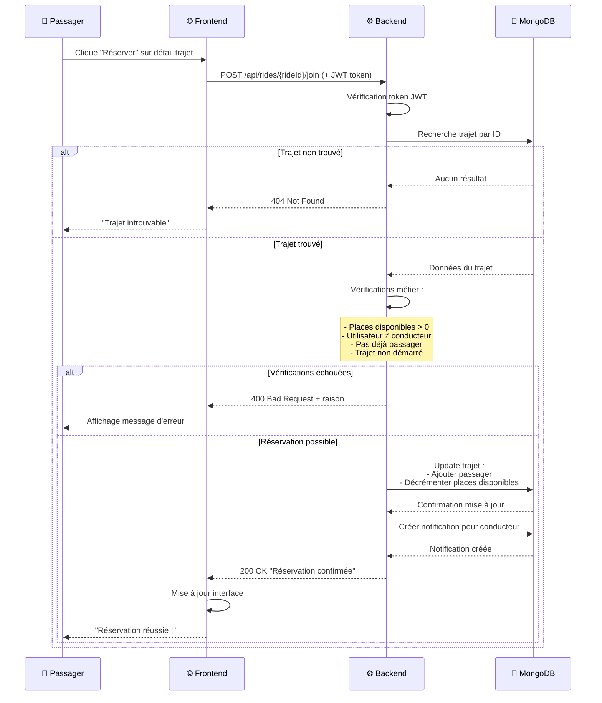

### **3.4 Séquence : Proposition d'un Trajet**

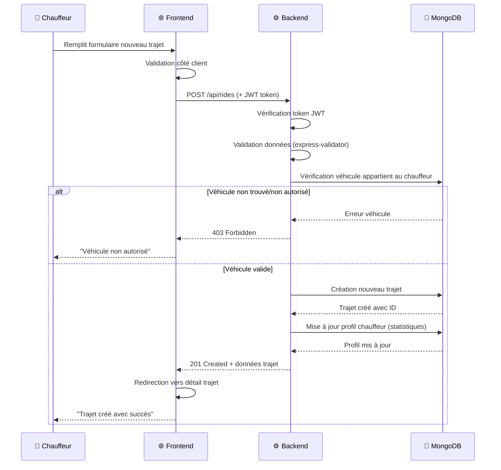

---

## 🗃️ **4. MODÈLE CONCEPTUEL DE DONNÉES (MCD)** {#mcd}

### **4.1 Entités Principales**

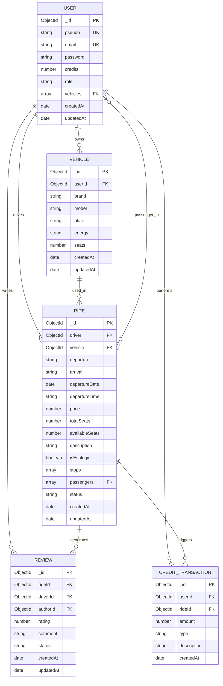

### **4.2 Relations et Cardinalités**

| Relation | Cardinalité | Description |
|----------|-------------|-------------|
| **User → Vehicle** | 1:N | Un utilisateur peut posséder plusieurs véhicules |
| **User → Ride (driver)** | 1:N | Un chauffeur peut proposer plusieurs trajets |
| **User → Ride (passenger)** | N:M | Un utilisateur peut être passager de plusieurs trajets |
| **Vehicle → Ride** | 1:N | Un véhicule peut être utilisé pour plusieurs trajets |
| **Ride → Review** | 1:N | Un trajet peut avoir plusieurs avis |
| **User → Review (author)** | 1:N | Un utilisateur peut écrire plusieurs avis |
| **User → CreditTransaction** | 1:N | Un utilisateur a plusieurs transactions de crédits |

---

## 🏗️ **5. DIAGRAMME DE CLASSES** {#classes}

### **5.1 Classes Métier Principales**

```mermaid
classDiagram
    class User {
        -ObjectId _id
        -string pseudo
        -string email
        -string password
        -number credits
        -string role
        -ObjectId[] vehicles
        -Date createdAt
        -Date updatedAt
        
        +register() boolean
        +login() string
        +updateProfile() boolean
        +addVehicle() boolean
        +getVehicles() Vehicle[]
        +joinRide() boolean
        +leaveRide() boolean
        +createReview() boolean
        +getHistory() Ride[]
    }
    
    class Vehicle {
        -ObjectId _id
        -ObjectId userId
        -string brand
        -string model
        -string plate
        -string energy
        -number seats
        -Date createdAt
        -Date updatedAt
        
        +create() boolean
        +update() boolean
        +delete() boolean
        +validate() boolean
        +getByUser() Vehicle[]
    }
    
    class Ride {
        -ObjectId _id
        -ObjectId driver
        -ObjectId vehicle
        -string departure
        -string arrival
        -Date departureDate
        -string departureTime
        -number price
        -number totalSeats
        -number availableSeats
        -string description
        -boolean isEcologic
        -string[] stops
        -ObjectId[] passengers
        -string status
        -Date createdAt
        -Date updatedAt
        
        +create() boolean
        +addPassenger() boolean
        +removePassenger() boolean
        +start() boolean
        +complete() boolean
        +cancel() boolean
        +search() Ride[]
        +getByDriver() Ride[]
        +getByPassenger() Ride[]
    }
    
    class Review {
        -ObjectId _id
        -ObjectId rideId
        -ObjectId driverId
        -ObjectId authorId
        -number rating
        -string comment
        -string status
        -Date createdAt
        -Date updatedAt
        
        +create() boolean
        +moderate() boolean
        +approve() boolean
        +reject() boolean
        +getByDriver() Review[]
        +getByRide() Review[]
    }
    
    class CreditTransaction {
        -ObjectId _id
        -ObjectId userId
        -ObjectId rideId
        -number amount
        -string type
        -string description
        -Date createdAt
        
        +create() boolean
        +processPayment() boolean
        +refund() boolean
        +getByUser() CreditTransaction[]
        +getBalance() number
    }
    
    User ||--o{ Vehicle : owns
    User ||--o{ Ride : drives
    User }o--o{ Ride : passenger_in
    Ride ||--o{ Review : has
    User ||--o{ Review : writes
    User ||--o{ CreditTransaction : performs
    Vehicle ||--o{ Ride : used_in
    Ride ||--o{ CreditTransaction : triggers
```

### **5.2 Classes Contrôleurs**

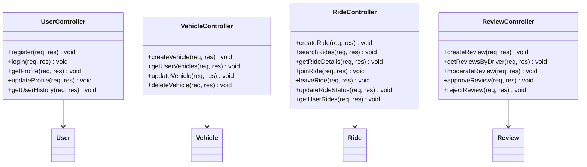

---

## 🏛️ **6. ARCHITECTURE TECHNIQUE** {#architecture}

### **6.1 Vue d'Ensemble de l'Architecture**

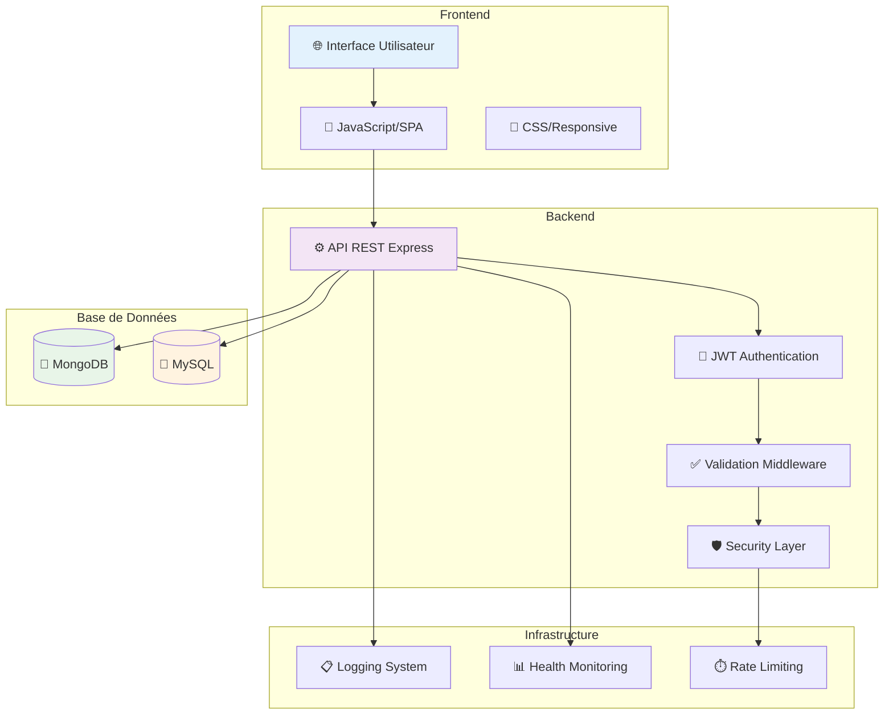

### **6.2 Architecture en Couches**

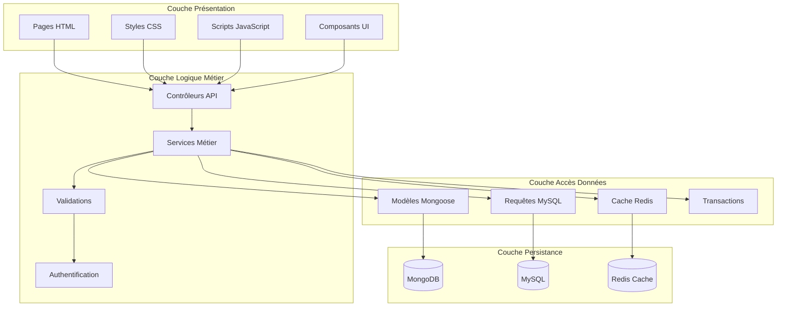

### **6.3 Flux de Données**

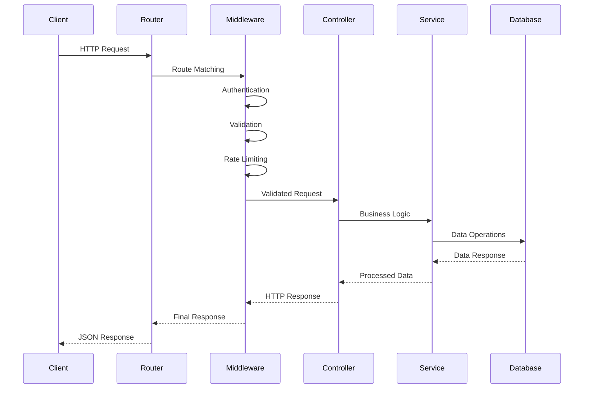

---

## 🚀 **7. DIAGRAMME DE DÉPLOIEMENT** {#deploiement}

### **7.1 Architecture de Déploiement**

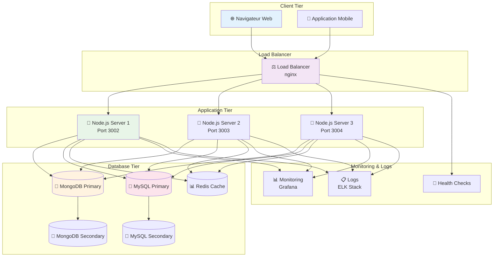

### **7.2 Environnements de Déploiement**

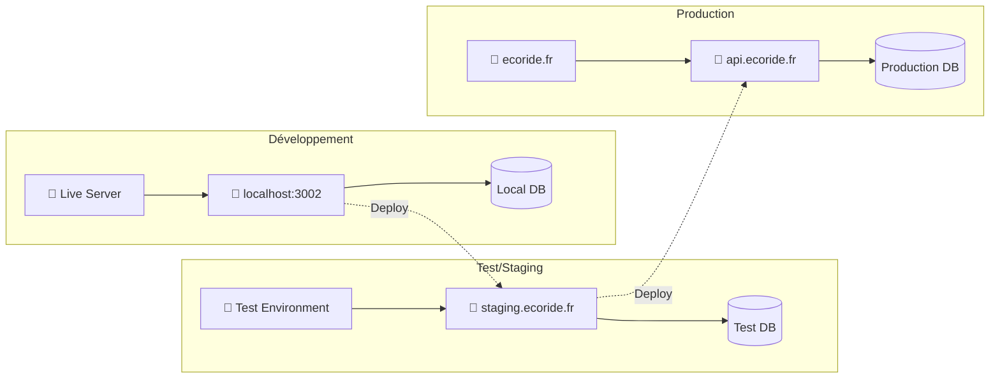

### **7.3 Configuration de Sécurité**

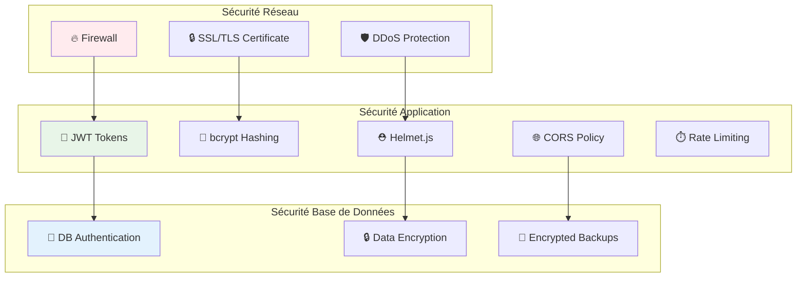

---

## 📈 **CONCLUSION**

Cette documentation UML complète de **EcoRide** fournit :

### ✅ **Avantages de cette Analyse**
- **Vision globale** du système et de ses interactions
- **Guide technique** pour les développeurs
- **Base documentaire** pour la maintenance et l'évolution
- **Référence** pour les audits de sécurité et qualité

### 🔄 **Évolutions Prévues**
- Intégration d'une API de géolocalisation en temps réel
- Système de notifications push
- Module de paiement intégré (Stripe/PayPal)
- Intelligence artificielle pour l'optimisation des trajets

### 📊 **Métriques Techniques**
- **Modularité** : Architecture en couches découplées
- **Scalabilité** : Support horizontal avec load balancing
- **Sécurité** : Authentification JWT + bcrypt + rate limiting
- **Performance** : Cache Redis + optimisations base de données

---

*Ce document évolue avec le projet EcoRide. Dernière mise à jour : 3 octobre 2025*